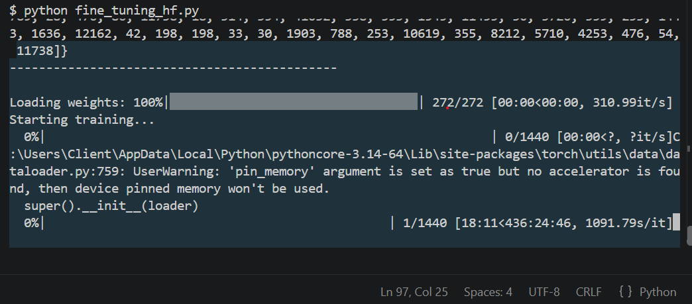
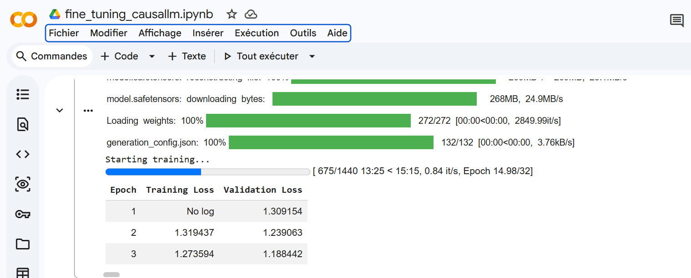

## How to use

This is a user guide to run succeffly this code with huggingface
1- create a new envirement, this step is optional

```powershell
python -m venv hft-env
.\hf-env\Scripts\Activate.ps1

```

for mac and linux

```bash
python3 -m venv hft-env
source hft-env/bin/activate
```

2- install requirements

```bash
pip install --upgrade pip
pip install -r requirements.txt
```

3- Authenticate and login huggingface

* go to huggingface.co/settings/tokens
* click new token to create a new with giving a name (E.g finetuning), dont forget to set role to write and copy the token.
* in your terminal, execute the below

```bash
huggingface-cli login

```

Past the token.

5- run the fine_tuning_hf.py

```powershell
py fine_tuning_hf.py
```

the code works but in my personal conputure is very slow due to my configuration :

* 8 G of ram
* CPU 2,6 Ghz :(
  The use d modelis not big "HuggingFaceTB/SmolLM2-135M-Instruct" and just i test to tuning it with 200 row of data

```python
dataset = load_dataset("HuggingFaceTB/smol-smoltalk", split="train[:200]") 
```

But with this configuration i must wait about  only 436h


So i swich to Google Colab netbook, because google offer a free use of GPU as an test alternative:
1- Go to google colab
2- select T4 GPU as a hardware
3- Run the code there

This is a link of the nootbook on google colab, you are free to access

[https://colab.research.google.com/drive/1UOhTBHs751vaJKdKWPoDJ2hF9OmH8Dre?usp=sharing](https://)

Below the processing with google Colab, From 436 Hours to 16 min

