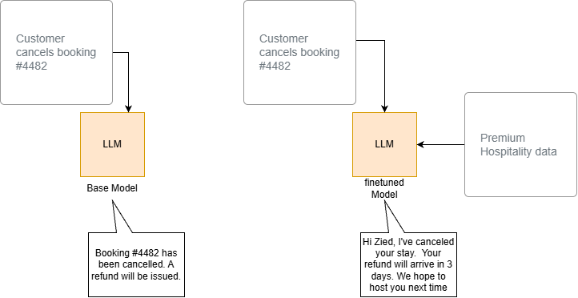
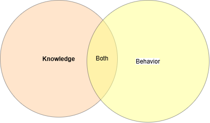

# Fine tuning & LLM OPS

### Intro

In this post i'll talk about two essential AI terme and every AI engineer must know, and i'll explain when and in what situation to use them.

the first one is the fine tuning, so what is that meen, fine tuning is about a process of taking an existing pre-trained model and traini9ng it further on a smaller, specific data set so it can perform specialized task. and in a next section i'll explain how it work and why using it.

The second term is the LLMOps, LLMOps in short for Large Language Model Operations, it's the practice the entire life cycle of  large language model and generative AI from ddevelopment to deployement. Dont confuse between LLMOps and LMOps, LLMOps is a specialized subset of MLOps. If you curious to know the difference, click on the link at the [Appendix](#Appendix) section.

### Fine Tuning

As we saw in intro, fine tuning is a continious training a large pretrained model on a smaller dataset specific to task or domain, For Exemple, fine tuning on a dataset of coding examples help a model to get accurat code. Fine tuning is identical  to pretraining except we don't start with a random [weight](Appem), also it require mooooore less compute, data and time.

So in two word, fine tuning is a one of question response of the question: How to use my own data on my own task.

Exemple of famous model that are fine-tuning from a base model:

- Github copilot is a fine tunned from GPT-5.3-Codex
- Instruct-GPT it was fine tuned from GPT-3

So in this section you will see:

* Why finetuning
* where finetuning fit in
* instruction finetuning
* data preparation
* training process
* Evaluation and iteration
* consideration on getting started

If you not familar with python, i left a helpefull link in the [appedix](#Appendix) if you're not memeber of python family.

#### Why finetuning

Let'us start by conpairing the tuned model vs a no tuned model as shown in the figure below

Here i put the same prompt to two model, and you notice that i have a different output.

The first exemple give a generic output to inform me that my booking is cancelled and refund wil be issued with no extra information, just a generic output. In the other hand the finetuned model response with more specific message and it give me the delay of refund. The second model is trained on data where my booking is hosted.

Also, let'us compare finetuning with something you familar with, is prompt engeeniring:

|      | Prompt                                                                                                         | Finetuning                                                                                                                                  |
| ---- | -------------------------------------------------------------------------------------------------------------- | ------------------------------------------------------------------------------------------------------------------------------------------- |
| pros | - no data needed to start  - smaller cost - no technical knowdledge -connect data to RAG  | - lean new information based on private data - correct/incorrect informations - use Rag  - less cost if use a small model  |
| Cons | - less data fits   - forfets data  -  hallucianations - incorrect data                  | - more hight quality data - ûpfront compute cost  - needs some technical knowledge                                              |

prompting is great to generic, side project or prototype. In other side finetuning is usefull for specific domain and entreprise use cases, production usage or for who need to keep model privacy ...

The benificts of finetuning our own LLm is:

1- Performance:

* stop hullicination
* incrase consistency
* reduce unwanted informations

2- privacy:

* Local deployement, on prem or in your VPC
* prevent leackage
* no breaches

3- cost

* lower cost per request
* increased transparency
* greater control

3- Reliability

* control uptime
* lower latency
* moderation

### where finetuning fit in

Fine tuning fits into teh AI lifecycle as the crucial customization step that bind between general purpose foncdation model and a specific domain task. we start by a pretraining model, a model learns grammar, general facts and basic lamguage skills from massive dataset.

the objective is to get a model that learn a bunch of knowledge from given datasets.

generally, after getting a pretrained model, and use a datasets of data to finetunning, teh new model maybe need more knowledge to be more efficient. So finetuning refers to training further, it can be self supervised unlabled data, can be a labled data carefully selected ..

What the finetuning doing for us:

* changing the behavior of model: by learning to respond more consistently, learning to be focus and hilight capabilities.
* gain knowledge: increasing knowledge of new specific concept and correcting old incorrect information
* Or Boths

### Instructions fientuning

> Also named Instruction following or instruction tuned

Instruction finetuning is a machine learning method that teain a pretraining models to understand and execute explicit natural language command. The standard language model is trained only to predict the next word in the sentence, they good at finishing test but they fail when asked to a specific task, and the instruction finetuning fixes this gap, it teach the model to act as assiatant that obeys rules.

as i mention in the intro there is many model that we use daily but in reality they are born from of other larger model, example ChatGpt it finetuning from GTP-3!

**The datasets** : we can use a lot of data that come in online or from entreprise data (FQA, support customer, slack, teams ...), in the case where we dont have data, we can convert our data in question/response format or instruction format and we can use an other llm to doing this job for us, there is a technique called [alpaca](https://crfm.stanford.edu/2023/03/13/alpaca.html) and we can use a pipeline of different open source model to doing this as well.

### Data Preparation

Choosing and preparing data for machine learning or LLM finetuning requires aligning dataset characteristics with the model's target task, clean out noises and formatting teh records cleanly, filting data into prompt-response and split the set of data in train and test data.

* **High Quality & Consistency Over Quantity**

  * High-quality, well-formatted, and accurate data is significantly more effective for fine-tuning than large volumes of noisy data.
  * Consistency in styling, tone, and formatting across your dataset directly teaches the model how to respond in a production setting.
* **Structuring Data into Prompt-Response Pairs**

  * Instruction fine-tuning requires framing input text into structured pairs (often JSON or JSONL format).
  * Each entry consists of an explicit prompt/instruction (input) paired with the desired ideal response (output/completion).
* **Data Cleaning & Processing Pipeline**

  * **Tokenization Alignment:** Ensure character encodings and special tokens match the tokenizer expected by the base model.
  * **Deduplication:** Prune duplicate or overly similar instruction pairs to avoid overfitting.
  * **Filtering:** Remove incomplete examples, offensive/harmful content, and low-quality automated scrapes.
* **Train/Validation Splitting**

  * Split dataset cleanly into **Training** and **Validation/Test** sets.
  * Avoid data leakage between splits to ensure evaluation accurately measures out-of-sample generalization rather than memorization.

### Training Process

Training process is about end-to-end of LLM finetuning, we ca use many libreries to doing that (transformer, pytorch) and for exemple you can put your preapared dataset or data coming from huggingFace if you need to try it. dont forget, we talk about supervised fintuning, so belows soen takeaways and core concept:

#### 1. Fundamental LLM Training Loop

* **Standard Supervised Loop:** Like traditional neural networks, training involves running batches of tokenized instruction-response data, calculating loss against the target tokens, and backpropagating gradients to update model weights.
* **Epochs & Batches:** Training progresses across epochs (complete passes over the dataset) and batches (subsets of tokenized sequences).
* **Key Hyperparameters:** Essential knobs include `learning_rate`, `learning_rate_scheduler`, batch sizes, and optimizer settings (e.g., AdamW).

#### 2. Device Management & Sequence Handling

* **Hardware Allocation:** PyTorch requires explicit memory allocation—checking for available CUDA GPUs (`torch.cuda.is_available()`) and pushing both model weights and token tensors onto the target hardware (`.to(device)`).
* **Token Limits & Generation Bounds:** Inference functions control parameters like `max_input_tokens` and `max_output_tokens` to manage context window memory usage and prevention of infinite repetition during evaluation steps.

#### 3. Training Scale & Hardware Footprint

* **Model Size Considerations:** Even small models (e.g., Pythia-70M or Pythia-410M) require hundreds of megabytes to gigabytes of GPU VRAM due to model weights, optimizer states, and gradient buffers.
* **CPU vs. GPU Training:** While small demo models (70M parameters) can run on CPUs for educational walkthroughs, production fine-tuning typically requires larger models (1B to 7B+ parameters) trained on dedicated GPU infrastructure.

#### 4. Training Duration & Underfitting vs. Overfitting

* **Step Limit Effects:** Training for only a few gradient steps (e.g., 3 steps) leaves the model behaving identically to the base pre-trained model.
* **Full Dataset Passes:** Proper fine-tuning requires multiple passes over the dataset (e.g., 2–3 epochs). Over time, loss decreases, and the output transitions from generic/rambling text to structured, task-aligned answers.

#### 5. Safety & Moderation via Training Data

* **Refusal Training:** Just as instruction tuning conditions models to follow formats, embedding moderation examples directly into the training corpus (e.g., *"Let's keep the discussion relevant to..."*) trains the model to politely decline out-of-scope or unanswerable queries.

#### 6. High-Level Fine-Tuning Frameworks

* Low-level PyTorch code offers full control, but enterprise libraries (such as Hugging Face `Trainer`) simplify fine-tuning into high-level calls that manage distributed GPUs, evaluation benchmarking, and checkpoint logging automatically.

### Evaluation and Iteration

After training the model, it'S very important to evaluate the model, it's helps to improove the model over time. And evaluation a generative model is very very difficult because we dont have a clear matrics and performance for these model. So as result, teh human evaluation is the most reliable way, doing by a expert of the domaine and access to output for evaluation, also a good test dataset is crucial(hight-quality, accurate, generalized, without redundancy). An other popular way is ELO comparison, so it'S look likes A/B testing between multiple model. Also we can benshmark teh tuned model aginst the base model with the same test dataset.

We can evaluate our model with sementic simularity :

**cosine simularity :**

**BERT scoring :**

### Libraries

To finetuning you own model to your liking you have a choice of a serval of libreries :

* Pytorch of meta
* Lamini : llama librery
* Huggingface : the choice of community.

And at the end of this post, you find an exemple of fintuning a model using huggingface via the hugginface HUB.

#### Role Fine Tuning in LLMOps

Fine tuning modify the underlying weight of an existing foudation model to adapt its style, tone or domain knewldge. however, updating these parameters intriduces a massive operational that LLMOps framework directely resolve.

### Appendix:

[Difference between LLMOps And LMOps](https://www.geeksforgeeks.org/llmops-vs-mlops-making-the-right-choice/)

[What are model weight](https://engineadvocacyfoundation.medium.com/ai-essentials-what-are-model-weights-2e5b47ec77a1)

[Python for AI](https://www.deeplearning.ai/courses/ai-python-for-beginners)
